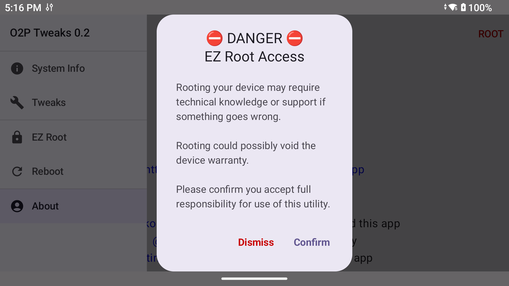
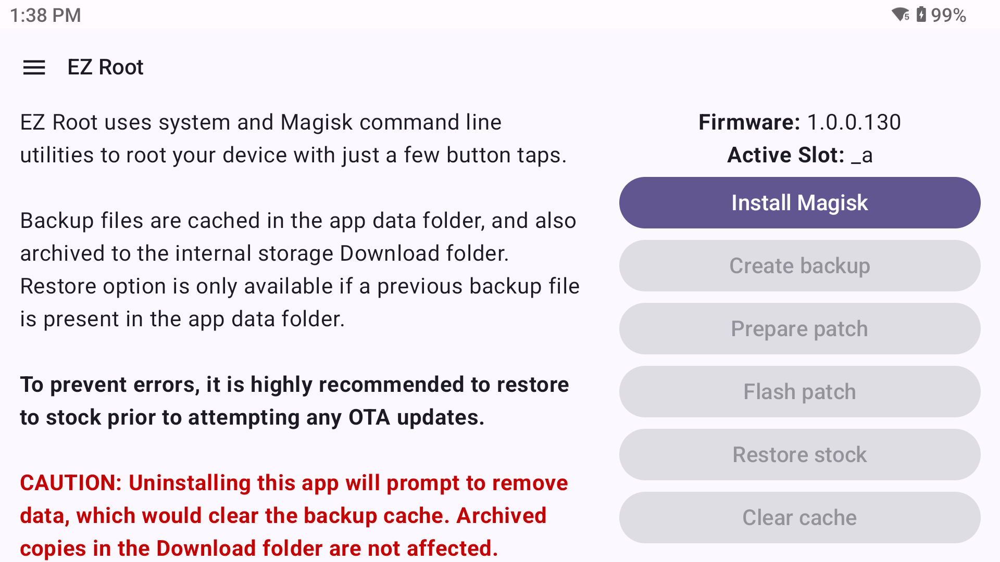
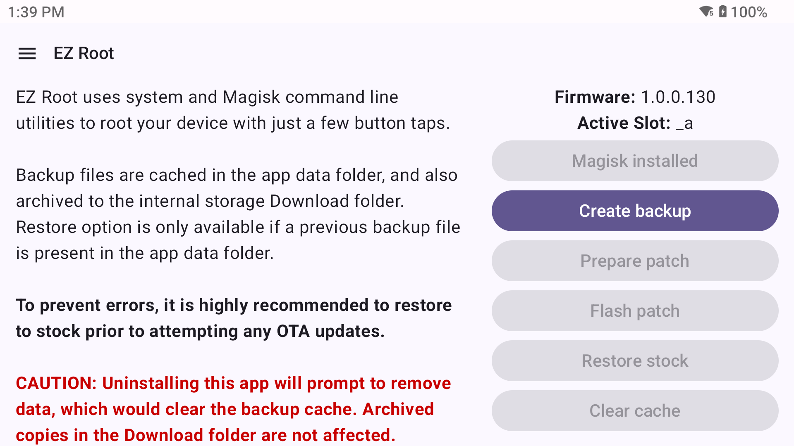
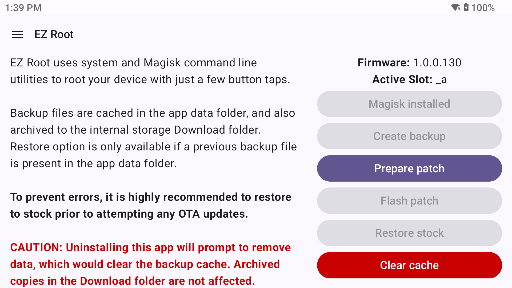
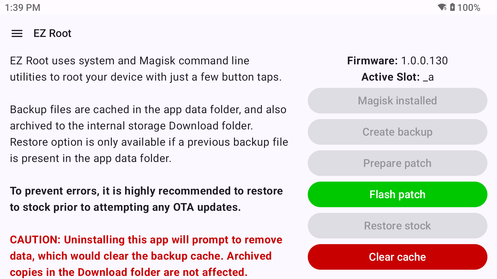
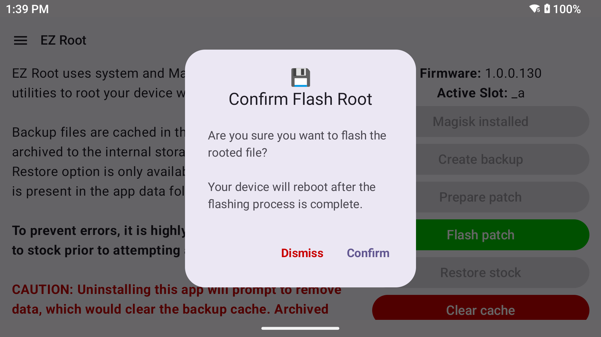
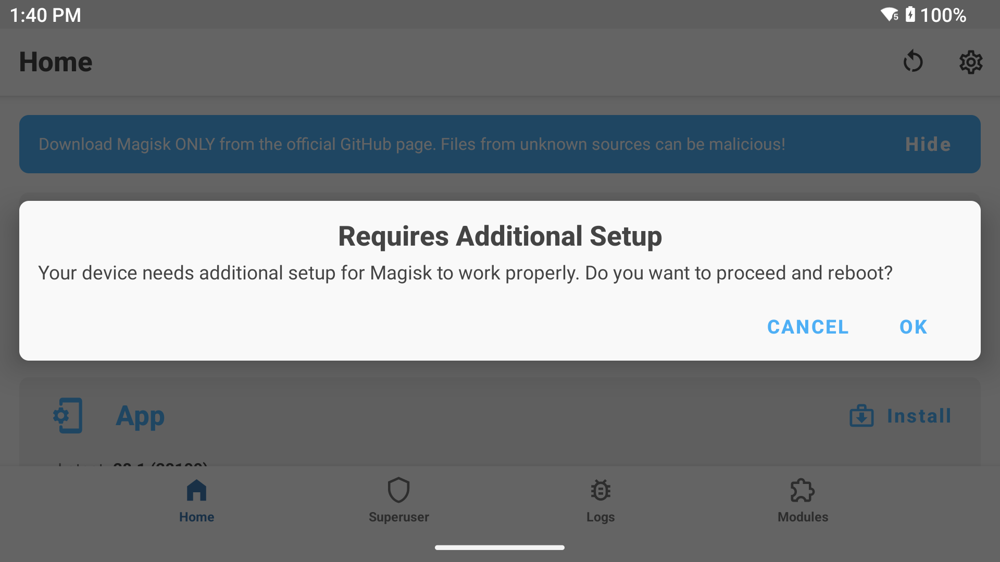
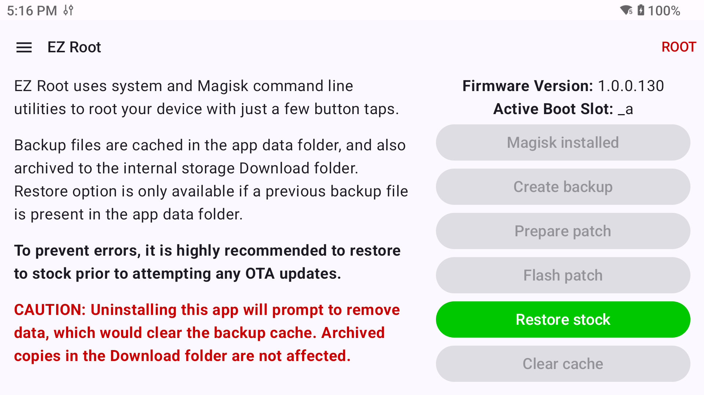

# EZ Root Guide

The EZ Root feature allows you to apply permanent root to your device with just a few button taps...without using PC utilities!

This **is not** a universal flash utility, and is designed specifically for patching the device for root access only.

## Requirements

EZ Root requires a device that contains the "Run script as Root" functionality provided by the some manufacturers.

[Magisk](https://github.com/topjohnwu/Magisk) is also required and can be downloaded and installed through the app, or you may manually install prior to using this feature.

## What device(s) are supported?

These devices are confirmed to work:

* AYN Odin2 Portal
* Retroid Pocket 5
* Retroid Pocket Flip 2 (SD865 version)
* Retroid Pocket Mini (V1 & V2)

Other devices from those manufacturers with the same chipsets are likely also compatilble.

The rooting process has been thoroughly tested on Android 13, and should work down to Android 10.

## Quick Steps

1. Open the EZ Root screen and accept prompt
2. Tap `Install Magisk` to install Magisk if not already present
3. Tap `Create backup` to backup the boot partition on your device
4. Tap `Prepare patch` to create a root-patched file of the boot partition
5. Tap `Flash patch` to flash the root-patched partition file to the device
6. Run Magisk and tap OK on the "Requires Additional Setup" prompt

## Detailed Steps

> **NOTE: This walkthrough assumes a fresh install on a stock device.**

### Step 1 - Accept Prompt

Each time O2P Tweaks is run and the EZ Root feature is accessed for the first time, you will be presented with a disclaimer and confirmation prompt:

You must accept this prompt to continue.

### Step 2 - Install Magisk

The **Install Magisk** button will check Github for the latest Magisk stable release, download it, then begin the app installation. Please allow O2P Tweaks to install applications when prompted. The downloaded Magisk APK file is located in your Download folder in case the automatic install wasn't started.

This step will be disabled if Magisk is already installed.

### Step 3 - Create Backup

The **Create backup** button will create backup disk images of the boot partitions for the device's active boot slot. This results in files with a name of `init_boot_a.img` and `boot_a.img` for Slot A, or `init_boot_b.img` and `boot_b.img` for Slot B.

The files are stored in the O2P Tweaks app data folder `/storage/emulated/0/Android/data/com.feralai.o2ptweaks/files`, and also archived to your internal storage Download folder in the case manual recovery is required.

### Step 4 - Prepare Patch

The **Prepare patch** button uses the Magisk command line utilities to create a root-patched version of one of the partition files from the backup step.

It will first attempt to patch the `init_boot.img`, and if unsuccessful will move on to patching the `boot.img`.

The **Clear cache** option will clear out all temp and backup files, and is only enabled before flashing root to the device. This will allow you to restart the patching process from the beginning if needed.

> NOTE: The `.img` file that doesn't receive a patch will be removed from the app data folder since it's not required to flash root access.

### Step 5 - Flash Patch

Once one of the `.img` files is patched, the **Flash patch** option will be enabled. Tapping this button will first prompt to confirm the flash step:

Once confirmed a flash status popup will show and the process will begin. This step is very quick, finishing in just a few seconds. The device will then reboot.

### Step 6 - Complete Magisk Installation

After rebooting from the flash step, open the Magisk application and you'll be prompted to complete setup:

Tap `OK` and Magisk will finish the install and reboot the device.

## Restoring Stock

The **Restore stock** option is only available if a previous partition backup is detected in the O2P Tweaks app data folder `/storage/emulated/0/Android/data/com.feralai.o2ptweaks/files`.

If your device has an OTA update available or you need to send it in for service, it is highly recommended to remove root access from your device using the **Restore stock** option.

This will present a similar confirmation prompt as when root was flashed, and takes the same amount of time to complete. Your device will automatically reboot once flashing back to stock is complete.

> NOTE: This does not remove the Magisk app or command line utilities from your device.
