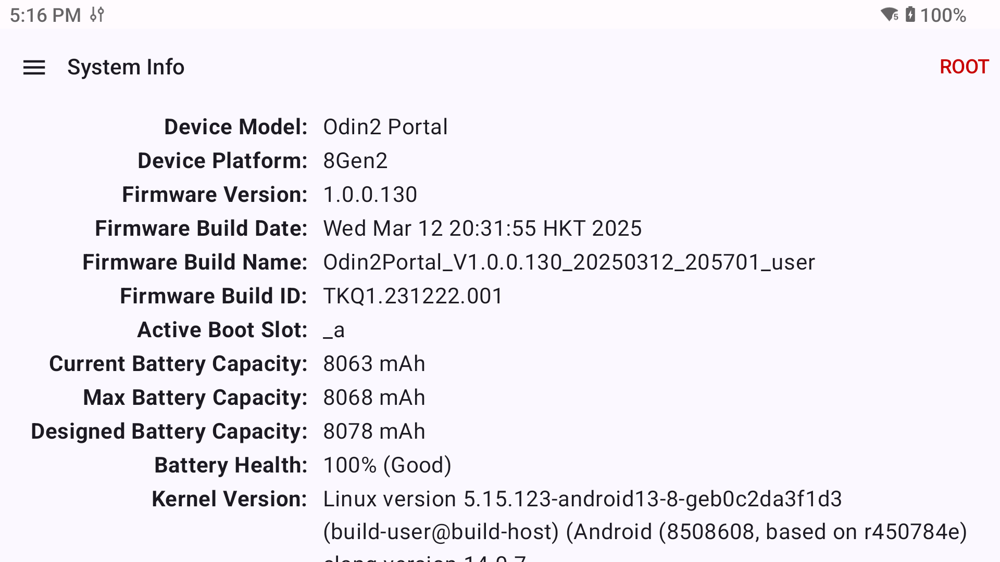
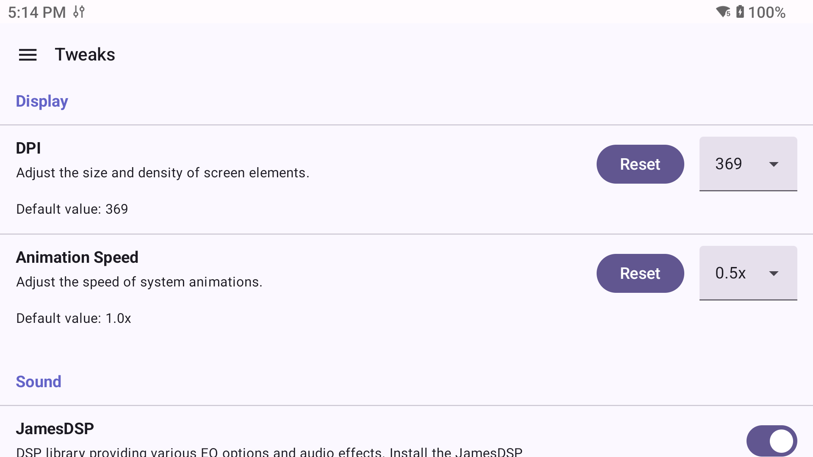
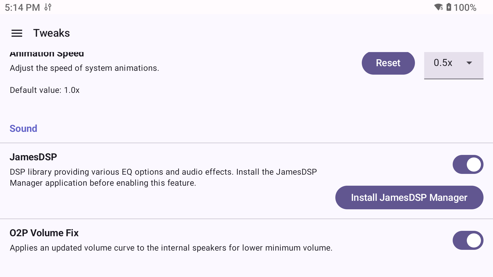
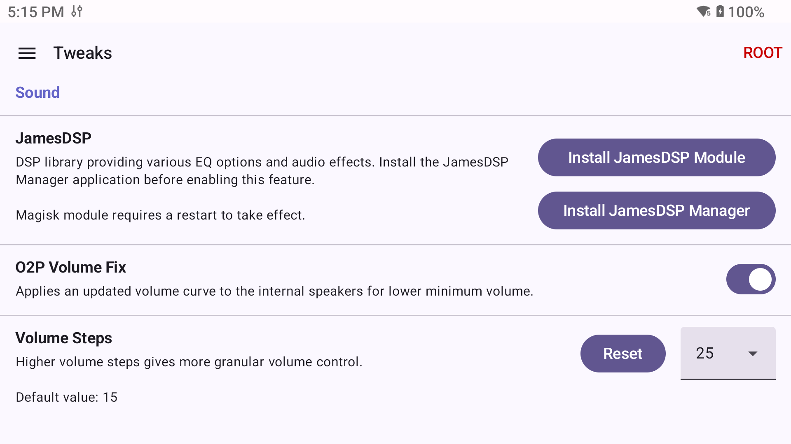

<h1>O2P Tweaks User Guide</h1>

Jump to section:

- [System Info](#system-info)
- [Tweaks](#tweaks)
  - [Display Tweaks](#display-tweaks)
  - [Sound Tweaks](#sound-tweaks)
- [Root Tweaks](#root-tweaks)
  - [Display Tweaks (ROOT)](#display-tweaks-root)
  - [Sound Tweaks (ROOT)](#sound-tweaks-root)
- [EZ Root](#ez-root)

## System Info

The System Info page provides some useful information about the device hardware and software.

## Tweaks

### Display Tweaks

* **DPI** - Uses the `wm density` command to set the display DPI. This setting persists between restarts without O2P Tweaks running.
* **Animation Speed** - Adjust the speed of system animations. This sets the `animator_duration_scale`, `transition_animation_scale` and `window_animation_scale` global settings, similar to the options in the Developer menu.

### Sound Tweaks

* **JamesDSP** - Toggle enabling or disabling loading the JamesDSP library via the "Run script as Root" functionality. JamesDSP Manager app is required and presented as an install option on this screen. See [JamesDSP Setup](JAMESDSP.md) for more details.
* **O2P Volume Fix (O2P only)** - The Odin 2 Portal lowest volume is too loud for a lot of users, so this option applies a different volume curve to the internal speakers to mitigate this issue.

## Root Tweaks

Running on a rooted device will make more tweaks available and allow certain existing tweaks to be applied boot instead of runtime. This is done by dynamically generating a Magisk module with the relevant options, which is then loaded on startup.

### Display Tweaks (ROOT)

* **DPI** - Uses the `wm density` command to set the display DPI, and also sets the `ro.sf.lcd_density` build prop in the O2P Tweaks Magisk module. This setting persists between restarts without O2P Tweaks running.
* **Animation Speed** - Adjust the speed of system animations. This sets the `animator_duration_scale`, `transition_animation_scale` and `window_animation_scale` global settings, similar to the options in the Developer menu.

### Sound Tweaks (ROOT)

* **JamesDSP** - Install JamesDSP via a Magisk module instead of the typical method. This avoids the need for O2P Tweaks to run at startup, and is the recommended method for using JamesDSP on a rooted device. See [JamesDSP Setup](JAMESDSP.md) for more details.
* **O2P Volume Fix (O2P only)** - The Odin 2 Portal lowest volume is too loud for a lot of users, so this option applies a different volume curve to the internal speakers to mitigate this issue. This will be applied via the O2P Tweaks Magisk module on boot.
* **Volume Steps** - Adjust the number of volume steps when using the Vol- and Vol+ buttons. Higher values provide more granular volume control. Applied via the `ro.config.media_vol_steps` build prop in the O2P Tweaks Magisk module.

## EZ Root

Check out the [EZ Root guide](EZROOT.md) for details on usage.
